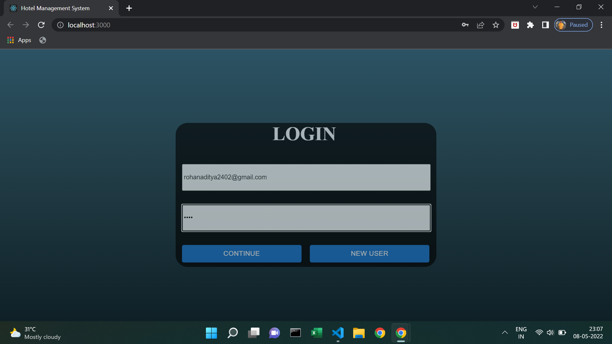
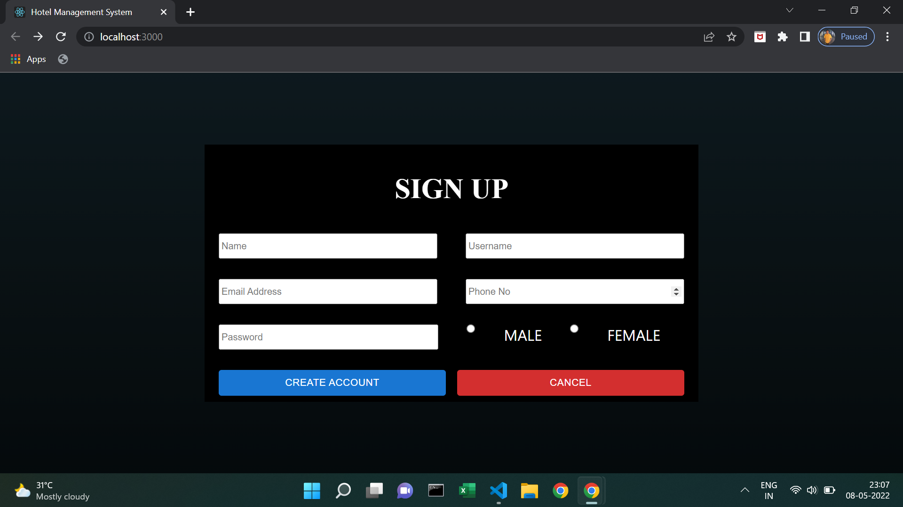
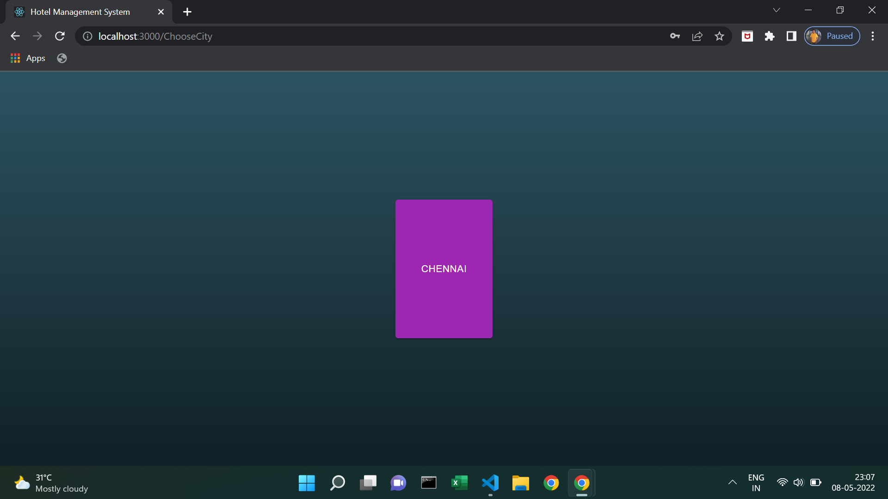
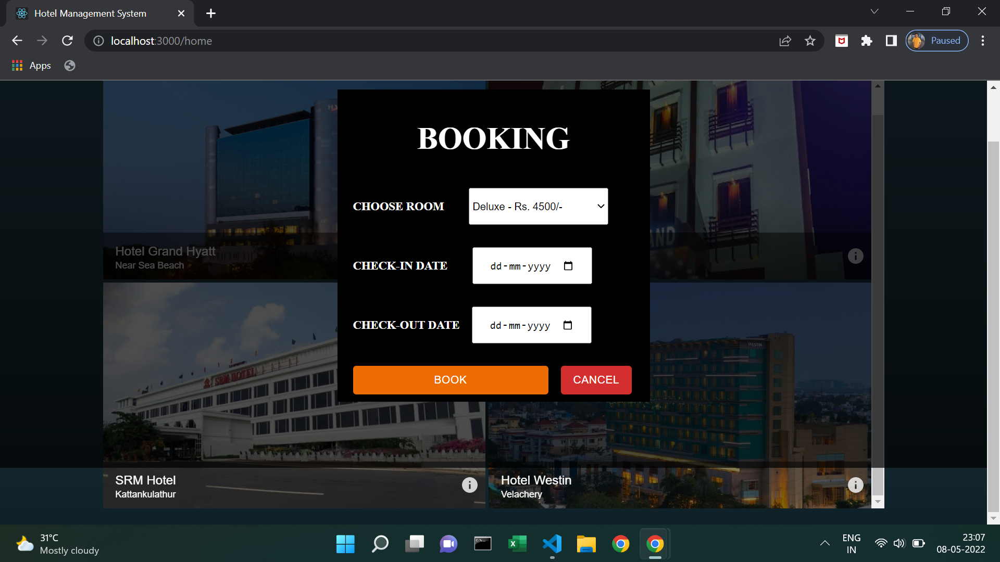

# Hotel Booking System

This full stack application was developed for the course project: 18CSE302J - Full Stack Development with MERN. 

The objective of the project was to develop a Full Stack Application for Hotel Booking. To achieve this, we have used the MERN Stack. The project makes use of MongoDB for the database, React, HTML, CSS for front-end. Material - UI has also been used for the beautification of pages.

# How to run the project?
1. Setup the database using the files provided.
2. Extract front-end code and save it in a directory. 
3. Re-direct to the directory in the command prompt and run 'npm install' to install all the required node modules. 
4. Run 'npm start'.
5. UI will load on localhost:3000

# 

# Output

